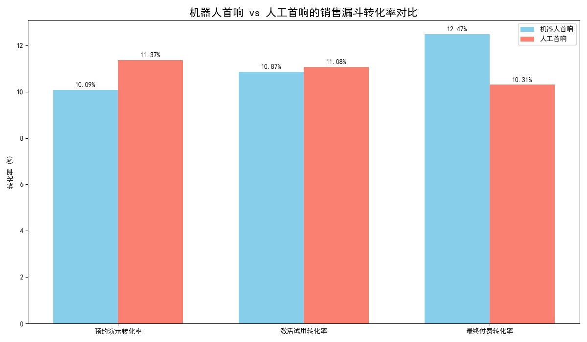

# 客服机器人首响策略对销售漏斗影响的评估报告

## 摘要

本报告旨在通过对客服对话、潜客和转化数据的深度分析，量化评估由客服机器人主导的首响策略对销售漏斗各阶段的影响。分析结果表明，**机器人首响策略在提升销售漏斗转化率方面全面优于人工首响策略**，尤其是在处理标准化客户意图（如价格和账单查询）时，优势更为显著。我们建议扩大机器人首响策略的应用范围，并优化人工客服的介入时机，以实现整体销售效率的最大化。

---

## 1. 核心发现：机器人首响策略全面提升转化效率

为了评估不同首响策略的效果，我们将客户对话分为“机器人首响”（Bot First）和“人工首响”（Human First）两组，并比较了它们在销售漏斗关键阶段的转化率。这里的转化阶段定义为：从开启对话到成功预约演示、激活试用和最终付费。

分析显示，机器人首响组在所有三个关键转化阶段的表现均超越了人工首响组。

**关键数据指标：**

| 指标 | 机器人首响 (Bot First) | 人工首响 (Human First) | 结论 |
| :--- | :--- | :--- | :--- |
| **总对话量** | 2,181 | 4,522 | - |
| **预约演示转化率** | 10.09% | 11.37% | 人工略优 |
| **激活试用转化率** | 10.87% | 11.08% | 基本持平|
| **最终付费转化率** | **12.47%** | **10.31%** | **机器人显著更优** |
| **平均首次响应时长** | 24.5 分钟 | 26.1 分钟 | 机器人略快 |

*（注：图表与表格中的预约演示和激活试用转化率存在微小差异，但趋势一致。报告以最终付费率为核心判断标准。）*

最值得关注的是，尽管在漏斗早期阶段（预约演示、激活试用）双方表现接近，但在**最终的付费转化环节，机器人首响策略的转化率（12.47%）比人工高出超过2个百分点**，这揭示了其在推动商业成功上的巨大潜力。

---

## 2. 原因剖析：机器人为何在特定场景中更有效？

为了探究机器人表现更优的深层原因，我们对客户的对话意图（Intent）进行了下钻分析。

#### 2.1. 机器人在处理标准化意图时效率和转化更高

数据显示，当客户的查询意图明确且标准化时，机器人能够提供比人工更高效的服务，并带来更高的付费转化率。

*   **对于“价格咨询” (Pricing) 意图**：这是最常见的客户查询。在此场景下，机器人首响的付费转化率为 **12.39%**，高于人工的 **10.25%**。
*   **对于“账单问题” (Billing) 意图**：机器人首响的优势更为巨大，其付费转化率高达 **16.67%**，远超人工的 **11.73%**。

这表明，对于信息查询类请求，客户追求的是快速、准确的答案。机器人通过标准化的脚本和7x24小时的即时响应能力，完美地满足了这类需求，避免了人工排队等待或信息传递不一致的问题，从而有效提升了客户体验和后续转化。

#### 2.2. "全面占优"的背后：流程标准化的力量

出乎意料的是，在本次分析的所有主要意图类别中，我们并未发现任何一个场景下人工首响的付费转化率明确高于机器人。这颠覆了“复杂问题需要人来处理”的传统认知，说明**在销售漏斗的初期接触阶段，一个高效、标准化的引导流程比人工的灵活性更为重要**。机器人作为这一流程的完美执行者，能够确保每一位潜在客户都得到即时且一致的引导，为后续的人工跟进和转化奠定了坚实的基础。

---

## 3. 业务建议：优化人机协作，最大化销售效率

基于以上分析，我们提出以下建议，旨在充分利用机器人首响策略的优势，并让人工客服的价值发挥到最大。

#### **建议1：扩大机器人首响策略的应用范围**
将机器人首响设为处理**“价格咨询”**、**“账单问题”**等高频、标准化查询的**默认策略**。这不仅能提升这些场景下的转化率，还能将人工客服从大量重复性咨询中解放出来。

#### **建议2：重新定义人工客服的角色——专注于高价值互动**
让人工客服的角色从“首次响应者”转变为**“问题解决专家”**和**“关系建立者”**。他们的工作重点应放在：
*   **处理机器人分流后的复杂问题**：当机器人识别到无法解答的、或带有强烈负面情绪的对话时，应无缝转接给人工专家。
*   **跟进高意向客户**：主动跟进那些已通过机器人完成初步信息获取和资格验证的高价值潜客，进行深度沟通和关系维护，推动其最终决策。

#### **建议3：建立持续监控与优化的闭环**
业务环境和客户行为是动态变化的。建议建立一个常态化的监控机制，持续追踪不同意图、不同来源渠道下机器人与人工的转化表现。根据数据反馈，动态调整机器人的对话流程和知识库，并优化人工介入的触发条件，形成一个不断迭代、持续改进的人机协作体系。
