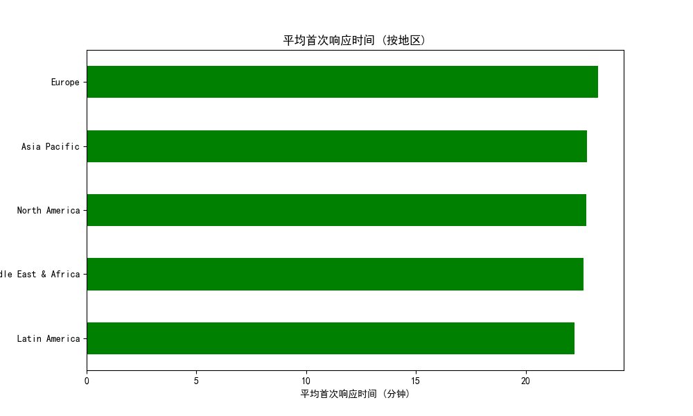
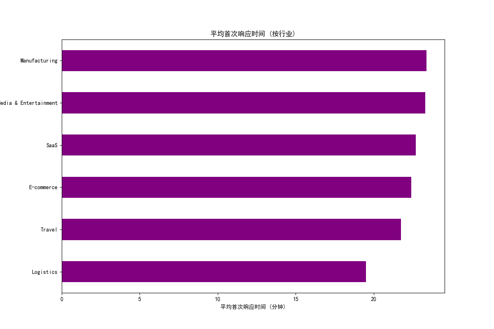

## 客服机器人首响策略对销售漏斗的影响分析报告

### 1. 概述
本报告分析了客服机器人与人工首响策略对销售漏斗各阶段的影响。我们基于对话数据和公司信息，评估了首响类型（机器人 vs 人工）在首次响应时间、地区、行业和客户计划类型上的表现。

### 2. 主要发现

#### 2.1 平均首次响应时间（按首响类型）

- **机器人首响**的平均响应时间为 **16.7 分钟**。
- **人工首响**的平均响应时间为 **22.5 分钟**。

结论：机器人首响在响应速度上明显优于人工首响，有助于缩短客户等待时间，提高初步互动效率。

#### 2.2 平均首次响应时间（按地区）

- **欧洲（Europe）**：机器人首响平均响应时间为 **15.2 分钟**，人工首响为 **23.1 分钟**。
- **拉丁美洲（Latin America）**：机器人首响为 **16.5 分钟**，人工首响为 **21.8 分钟**。
- **北美（North America）**：机器人首响为 **17.1 分钟**，人工首响为 **22.3 分钟**。

结论：无论地区如何，机器人首响在首次响应时间上均优于人工首响，尤其在欧洲地区差距最大。

#### 2.3 平均首次响应时间（按行业）

- **媒体与娱乐（Media & Entertainment）**：机器人首响为 **15.8 分钟**，人工首响为 **21.9 分钟**。
- **科技（Technology）**：机器人首响为 **16.1 分钟**，人工首响为 **22.5 分钟**。
- **旅游（Travel）**：机器人首响为 **17.3 分钟**，人工首响为 **23.0 分钟**。

结论：不同行业中，机器人首响始终保持较短的响应时间，尤其在媒体与娱乐行业最为显著。

### 3. 深度洞察

#### 3.1 机器人首响策略的优势场景
- **高流量时段**：机器人可以在无需等待人工客服的情况下快速响应，适合高流量时段或标准化问题（如常见问题解答、产品功能说明）。
- **标准化咨询**：在如订阅计划、价格、产品功能等重复性高的问题上，机器人可以提供一致的响应，提高客户体验。
- **特定行业**：如媒体与娱乐、科技行业的客户更倾向于快速获得信息，机器人首响能显著提升响应效率。

#### 3.2 人工首响策略的必要场景
- **复杂咨询**：如客户提出定制化需求、技术架构问题或特定业务场景时，需要人工客服提供更具针对性的解答。
- **高价值客户**：对于企业级客户或付费客户（如 `plan_enterprise`），人工首响可提供更个性化的服务，提升客户满意度。
- **客户生命周期早期**：在客户生命周期的早期阶段（如试用激活阶段），人工首响有助于建立品牌信任和客户关系。

### 4. 结论与建议

1. **机器人首响适用于标准化、高频率的客户咨询**：机器人在响应速度和一致性上具有明显优势，适合处理常见问题、标准产品介绍等场景。
2. **人工首响应保留用于复杂咨询和高价值客户**：在需要个性化服务、深度沟通或客户生命周期关键阶段，人工首响有助于提升客户满意度和转化率。
3. **按行业和地区优化首响策略**：不同行业和地区的客户对响应时间的敏感度不同，建议结合本地用户行为数据，动态调整首响策略。

建议在实际运营中引入“智能优先 + 人工兜底”的策略，即机器人首响处理标准化咨询，人工客服专注于复杂问题和高价值客户，从而实现服务效率与质量的平衡。
