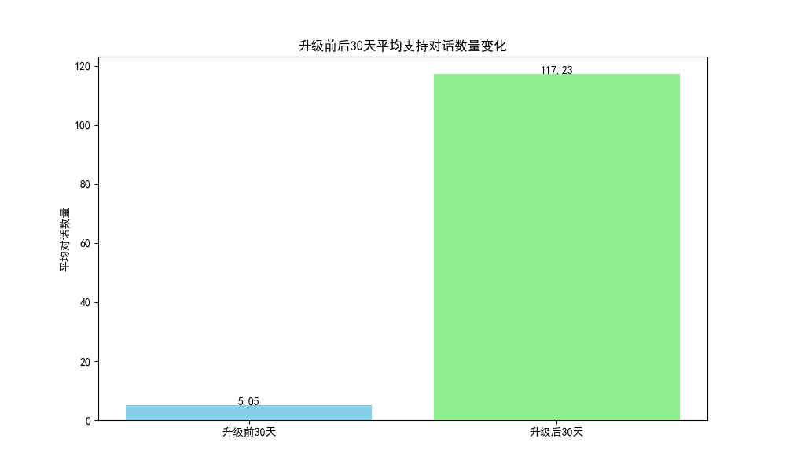
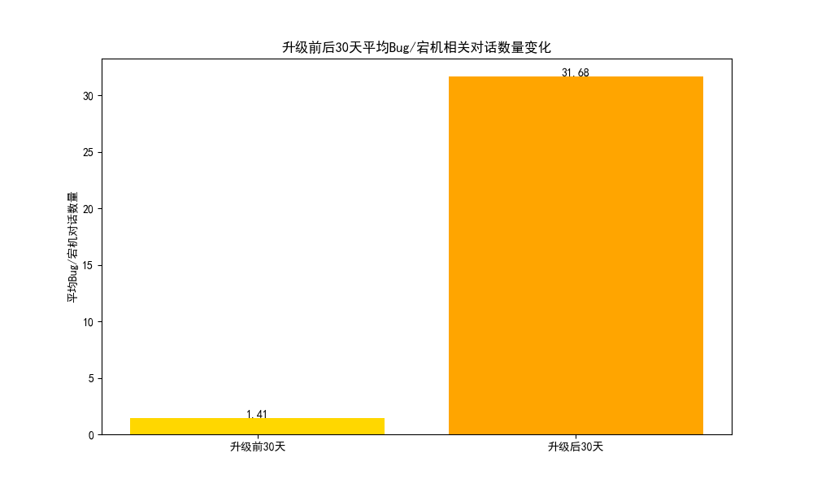
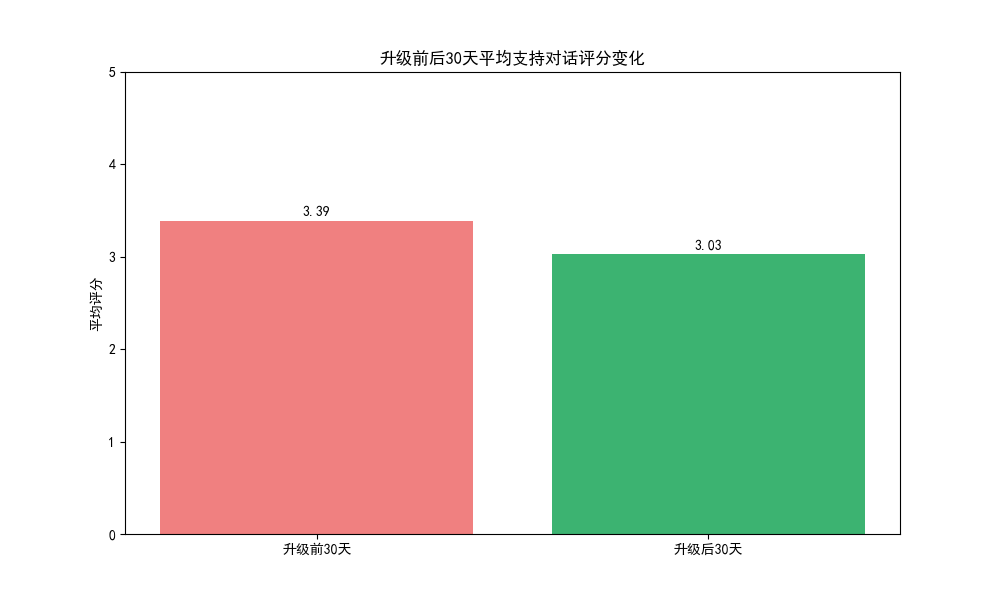

# 客户升级驱动因素分析报告

## 1. 执行摘要

本报告旨在识别导致客户升级的关键因素。通过分析客户在订阅变更前后30天的行为数据，我们发现了一个与直觉相反的现象：**所谓的“升级机会”事件发生后，客户与支持团队的互动非但没有减少，反而呈现爆炸式增长，尤其是在Bug和宕机等严重问题上。同时，客户的满意度评分也略有下降。**

这表明，当前的“升级”过程可能并非由积极的客户体验驱动，而是与解决现有问题或引入新功能的复杂性密切相关。本报告将详细阐述这些发现，并提出旨在改善客户升级旅程、提高客户满意度和长期留存的业务建议。

## 2. 分析方法

由于数据集中缺少明确的`upgrade_at`时间戳，我们采用以下代理方法来识别潜在的升级事件：

*   **升级事件定义**：我们将`intercom__conversation_enhanced`表中带有“Upgrade Opportunity”标签的对话作为识别升级事件的标志。对于每个公司，我们选取其**首次**出现该标签的对话时间作为基准事件时间点（t=0）。
*   **观察窗口**：我们在每个升级事件前后各设置了30天的观察窗口。
*   **核心比较指标**：
    *   **支持互动强度**：通过统计窗口期内的支持对话总数来衡量。
    *   **问题严重性**：通过统计包含“Bug”或“Outage”标签的对话数量来衡量。
    *   **客户满意度**：通过计算窗口期内对话的平均评分来衡量。

## 3. 核心发现

### 3.1. 升级后支持对话数量激增

分析显示，在升级事件发生后，客户发起的支持对话数量出现了惊人的增长。平均对话数从升级前的 **5.05** 次激增至升级后的 **117.23** 次。

这一现象强烈暗示，客户在升级到新套餐或功能后，遇到了大量 ранее未曾遇到的问题。这可能是由于新功能文档不完善、产品复杂性增加或客户在探索高级功能时触发了未知的使用场景。

### 3.2. 严重技术问题（Bug/宕机）显著增加

与对话总数的趋势一致，标记为“Bug”或“Outage”的严重技术问题在升级后也急剧增多。平均数量从升级前的 **1.41** 次上升到 **31.68** 次。

这暴露了一个严重问题：升级后的产品体验可能不如预期稳定。客户在为更高级的功能付费后，反而面临了更多的技术障碍，这会严重损害客户信任并增加流失风险。

### 3.3. 客户满意度略有下降

尽管问题数量大幅增加，但客户满意度评分的下降幅度相对较小，从升级前的 **3.39** 降至 **3.03**。

这可能归因于支持团队的努力，他们在客户最需要帮助的时候提供了响应。然而，评分的下降依然是一个警示信号，表明增加的摩擦确实对客户体验造成了负面影响。如果问题得不到根本解决，仅靠支持团队的补救是不可持续的。

## 4. 结论与业务建议

**结论：**
客户升级并非总是源于对当前服务的满意，反而更像是一个“问题驱动”的过程。客户在遇到现有计划的瓶颈后可能被引导升级，但升级后的体验却充满了新的挑战和技术问题。当前的“升级机会”更像是客户陷入困境的信号，而非成功的顶峰。

为了将升级转变为真正积极的客户旅程，并提升长期价值，我们提出以下**可操作的业务建议**：

1.  **优化升级客户的引导流程 (Onboarding)**
    *   **主动式引导**：为刚刚升级的客户提供专属的、主动的引导支持。不要等待他们遇到问题，而是提前提供新功能的教程、最佳实践和常见问题解答。
    *   **健康检查**：在客户升级后的第7天、第14天和第30天，安排客户成功经理进行主动的健康检查，以确保他们顺利使用新功能。

2.  **提升产品在高级功能上的稳定性**
    *   **优先修复升级相关Bug**：将升级后客户报告的“Bug”和“Outage”问题标记为最高优先级，并投入工程资源快速解决。分析这些问题，以从根本上改善高级功能的稳定性。
    *   **发布前的Beta测试**：在向更广泛的客户群推广新功能或更昂贵的套餐之前，邀请一小部分目标客户进行深入的Beta测试，以提前发现和解决潜在问题。

3.  **重新定义“升级机会”**
    *   **区分信号**：当销售或支持团队识别出“升级机会”时，应明确记录其背后的原因——是因为客户对当前服务满意并希望扩展，还是因为他们遇到了现有计划无法解决的问题？
    *   **建立预警系统**：将升级后对话数量的异常激增视为一个**客户流失风险的预警信号**，并立即启动关怀程序。

通过实施这些策略，公司可以将客户升级从一个充满摩擦的挑战，转变为一个巩固客户关系、提升满意度和实现可持续增长的真正机会。
