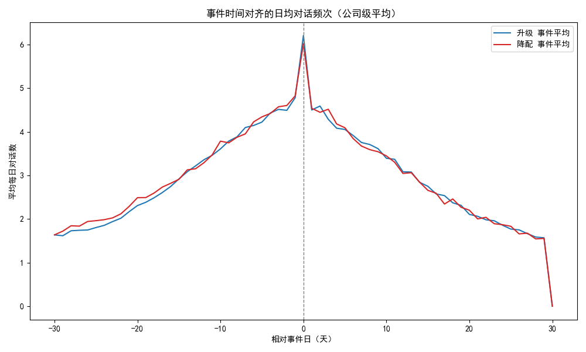
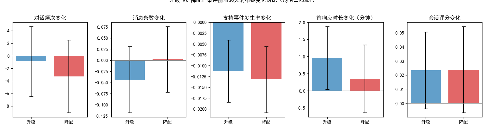
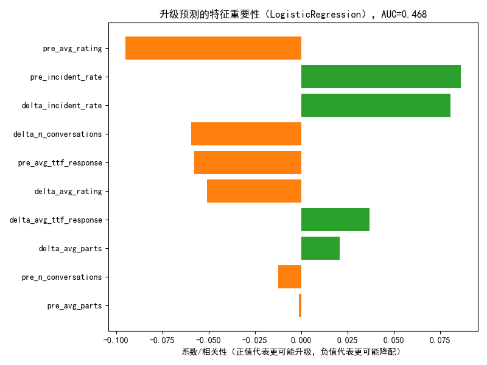

# 订阅升级/降配的驱动因素分析：事件时间线与前后30天体验对比

## 摘要
- 我们以会话标签/主题中包含“upgrade/downgrade”等关键词识别事件，构建公司级事件时间线。围绕每个升级/降配事件，比较事件前后30天与更早的30天基线窗口的体验指标变化。
- 关键结论（事件数：升级 1,198；降配 1,095；总计 2,293）：
  - 对话频次：两类事件前均出现明显“对话频次高峰”，降配前的相对增幅更大。事件后对话频次均回落，但降配的回落幅度更大（升级 Δ-0.89；降配 Δ-3.25 次/30天）。
  - 支持事件率：事件前期相对基线均升高（升级 +9.3%；降配 +7.6%），事件后下降（升级 +8.1%；降配 +3.6%），表明“事件前的支持事件增多”是一个普遍触发因素，但对升级/降配的区分度有限。
  - 体验质量：事件后首响时长小幅上升（升级 +0.96 分钟；降配 +0.35 分钟），会话评分均略升（约 +0.02～0.03），二者对升级/降配的区分度不强。
  - 预测性分析：用前窗与变化特征预测升级的模型 AUC≈0.468（不足以部署）。特征方向性显示：更高的“前窗支持事件率”略倾向于升级，较高“前窗评分”反而与降配相关，但整体可分性较弱，需引入更多产品功能使用与计费约束特征。

下图展示了事件时间对齐的对话频次趋势、前后窗口核心指标变化、以及特征重要性（或相关性）结果：
- 事件时间对齐趋势图（对话频次）：
- 前后窗口指标变化对比（均值±95%CI）：
- 升级预测特征重要性（LogisticRegression，AUC≈0.468）：

## 数据与方法
- 数据源（SQLite）：
  - intercom__conversation_enhanced：会话基础、标签、主题、关联公司名、关闭时间等。
  - intercom__conversation_metrics：会话度量（评分、响应时长、消息条数、重开次数等）。
  - intercom__company_enhanced / intercom__company_metrics：公司维度元数据（本分析主要用会话关联公司名）。
- 事件识别与时间线构建：
  - 使用会话标签或主题包含关键词 upgrade / plan upgrade / upsell 定义“升级”，downgrade / plan downgrade / downsell 定义“降配”。
  - 事件时间 = 该类会话的创建时间；公司名取联系公司列表的首个条目作为归属。
- 观察窗设定（相对事件时间 T0）：
  - 基线：[-60, -31] 天；前窗：[-30, -1] 天；后窗：[+1, +30] 天。
- 核心指标（每公司在各窗口的聚合）：
  - 活跃度：对话数量（n_conversations）、消息条数（avg_parts）。
  - 支持压力：支持事件率（is_incident，基于 bug/issue/outage/fail/latency 等关键词）。
  - 体验质量：会话评分（avg_rating）、首响/关闭时长（avg_ttf_response / avg_ttf_close / avg_ttl_close）、重开次数（avg_reopens）。
  - 变化量：post - pre；相对基线：pre/base - 1、post/base - 1。
- 注意：本分析未作数据清洗，仅进行类型转换与基于字段的特征识别。将“功能使用强度”用对话频次与消息条数作为可获得的近似代理。

## 主要发现

1) 事件前“对话频次高峰”普遍存在，降配前更显著
- 升级：前窗对话数均值 84.01，后窗 83.12，Δ -0.89；相对基线（pre）+171.9%，（post）+88.9%。
- 降配：前窗对话数均值 85.97，后窗 82.72，Δ -3.25；相对基线（pre）+218.2%，（post）+77.0%。
- 解读：订阅变更发生前，客户-我们之间的互动显著升温（咨询、问题、需求沟通）。降配客户的前窗“讨论热度”更高，且事件后回落更快/更多，这可能反映为“问题驱动 + 失望退出”模式。

2) 支持事件率在事件前上升，但对升级/降配的区分度有限
- 升级：incident_rate（pre→post）Δ -0.011；相对基线 pre +9.3%，post +8.1%。
- 降配：incident_rate（pre→post）Δ -0.013；相对基线 pre +7.6%，post +3.6%。
- 解读：事件前支持事件率提升说明客户在变更前期遇到了更多问题或复杂需求。升级客户在事件后依然维持相对较高的事件率（+8.1%），可能意味着他们仍在推进复杂用例、深入使用功能；降配客户则更趋于回到接近基线。

3) 体验质量差异不显著：评分略有提升，响应时长轻微上升
- 评分：升级 Δ +0.023；降配 Δ +0.024。
- 首响时长：升级 Δ +0.96 分钟；降配 Δ +0.35 分钟。
- 解读：在会话评分与首响时长上，升级/降配未体现出显著差异，说明仅凭这些“通用服务体验指标”很难解释订阅变更方向。

4) 预测性分析：可分性不足，但方向性线索有助运营策略
- LogisticRegression AUC≈0.468，当前特征集合对区分升级/降配不足以直接部署。
- 方向性（正值更倾向升级）：
  - 前窗支持事件率（+）：更高的事件率略偏向升级，这可能反映出客户在探索更复杂场景/进阶功能，需要更多支持。
  - 前窗评分（-）：更高评分略偏向降配，可能是成本/价值权衡或“用得少但满意”的客户选择降配；也可能是噪音，需要更多功能使用数据验证。
- 需要补充的关键特征（非本库数据）：功能调用量与配额触顶、席位数变化、开单类型主题（增长/权限/报表/集成）、计费相关信号（超限提示、折扣到期、续费周期）。

## 可操作建议

A. 风险与机会的“窗口化”运营编排
- 监控相对基线的对话频次激增（例如 pre/base > +100% 且近7日滚动仍在上升），作为订阅变更前的强信号。
- 对“频次激增 + 支持事件关键词（bug/outage/latency/limit等）”的组合，设置不同剧本：
  - 升级机会剧本：当频次激增伴随“进阶/扩容诉求”（例如性能、集成、权限），快速路由至销售顾问与解决方案架构师，提供试用扩容、功能演示与ROI测算。
  - 降配风险剧本：当频次激增后出现“回落过快 + 无明确进阶诉求”，由客户成功经理回访梳理价值点，提供配置优化与轻量方案，避免流失或无谓降配。

B. 对“降配前高峰”的前置干预
- 针对前窗对话激增且主题偏“问题驱动”的客户，设定T+3/T+7 的专属问诊会，确保问题闭环并回收满意度。
- 对事件后对话大幅回落的客户，安排“价值回顾 + 新用例共创”会谈，阻断从降配到流失的链路。

C. 优化支持流程以服务“进阶使用者”
- 升级客户事件后仍维持较高事件率，建议为“高复杂度用例”提供加速通道：
  - 建立高优先级队列与高级工程师池；明确SLA（如首响<30分钟）。
  - 推出“技术成功计划”（TSM）或“架构评审”服务，提升复杂场景落地成功率，巩固扩张动能。

D. 数据与检测规则建设
- 在客服系统中补充结构化标签（功能、模块、配额、计费、集成），以便精确识别“升级动因 vs 降配动因”。
- 联合产品与计费数据接入：功能配额接近上限、席位变化、计费提醒、功能开通/关闭日志，增强可解释性与预测力。
- 建立“事件早预警分”（基于相对基线的对话频次、事件率、主题），对客户成功/销售进行每日推送，附带推荐动作与话术。

## 方法与代码摘录（含中文字体设置）
以下为用于绘图的关键代码片段（完整代码见工作目录 event_analysis.py）。注意包含中文显示设置：
```python
import matplotlib.pyplot as plt
from datetime import timedelta
import numpy as np
import pandas as pd

# 字体与负号
plt.rcParams['font.sans-serif'] = ['SimHei']
plt.rcParams['axes.unicode_minus'] = False

# 事件时间对齐的日均对话频次
def event_aligned_series(events, conv):
    aligned = []
    for _, ev in events.iterrows():
        company = ev['company_name']; t0 = ev['created_at']
        sub = conv[(conv['company_name'] == company) &
                   (conv['created_at'] >= t0 - timedelta(days=30)) &
                   (conv['created_at'] <= t0 + timedelta(days=30))].copy()
        sub['rel_day'] = (sub['created_at'] - t0).dt.days
        daily = sub.groupby('rel_day').size().reindex(range(-30,31), fill_value=0)
        aligned.append({'event_type': ev['event_type'], 'daily': daily})
    up = np.array([a['daily'].values for a in aligned if a['event_type']=='upgrade'])
    down = np.array([a['daily'].values for a in aligned if a['event_type']=='downgrade'])
    days = np.arange(-30,31)
    plt.figure(figsize=(10,6))
    if len(up)>0: plt.plot(days, up.mean(axis=0), label='升级 事件平均')
    if len(down)>0: plt.plot(days, down.mean(axis=0), label='降配 事件平均')
    plt.axvline(0, color='gray', linestyle='--'); plt.legend()
    plt.title('事件时间对齐的日均对话频次'); plt.xlabel('相对事件日（天）'); plt.ylabel('平均每日对话数')
    plt.tight_layout(); plt.savefig('conv_freq_event_time.png'); plt.close()

# 前后窗口关键指标变化对比（均值±95%CI）
def pre_post_change_bar(metrics):
    focus = [('delta_n_conversations','对话频次变化'),
             ('delta_avg_parts','消息条数变化'),
             ('delta_incident_rate','支持事件发生率变化'),
             ('delta_avg_ttf_response','首响应时长变化（分钟）'),
             ('delta_avg_rating','会话评分变化')]
    fig, axes = plt.subplots(1, len(focus), figsize=(15,4))
    for i,(col,label) in enumerate(focus):
        up = metrics.loc[metrics['event_type']=='upgrade',col].dropna()
        down = metrics.loc[metrics['event_type']=='downgrade',col].dropna()
        def mean_ci(x):
            m = x.mean(); se = x.std(ddof=1)/np.sqrt(len(x)); return m, 1.96*se
        up_m, up_ci = mean_ci(up); down_m, down_ci = mean_ci(down)
        axes[i].bar(['升级','降配'], [up_m, down_m], yerr=[up_ci, down_ci], alpha=0.7, capsize=4)
        axes[i].axhline(0, color='gray', lw=0.8); axes[i].set_title(label)
    fig.suptitle('升级 vs 降配：事件前后30天的指标变化对比', y=1.02)
    plt.tight_layout(); plt.savefig('pre_post_change_bar.png'); plt.close()
```

## 局限性与下一步
- 事件识别基于会话标签/主题关键词，可能存在误报/漏报；需要在客服流程中标准化“订阅变更”标签，并记录 upgrade_at/downgrade_at 的结构化时间戳。
- 本次将“功能使用强度”用会话频次与消息条数近似，尚未引入产品内真实使用日志（API调用/功能触达/席位变化/配额使用等），因此预测可分性弱（AUC≈0.468）。
- 支持事件识别基于通用关键词（bug/outage/latency等），未做主题细分；建议引入主题分类（计费/权限/性能/集成/报表），以更清晰解释升级 vs 降配的成因。
- 样本为 Intercom 会话数据，缺少财务/合同/产品遥测的联动，建议跨系统打通形成“客户360画像”。

## 结论
- 升级与降配事件前均伴随对话量显著上升，降配前的“峰值更高”，事件后对话回落更快更多。
- 事件前支持事件率普遍上升，但对升级/降配的区分度有限；评分与响应时长差异不显著。
- 运营落地重点：用“相对基线的对话频次激增 + 事件关键词”作为预警信号，分别触发“升级机会剧本”和“降配风险剧本”；为进阶使用者提供更快的技术支持通道；并尽快与产品与计费数据联动，提升预测与解释力。
