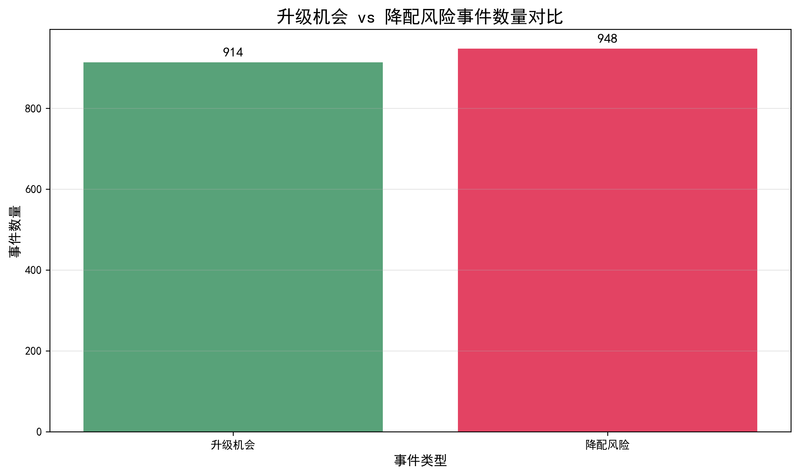
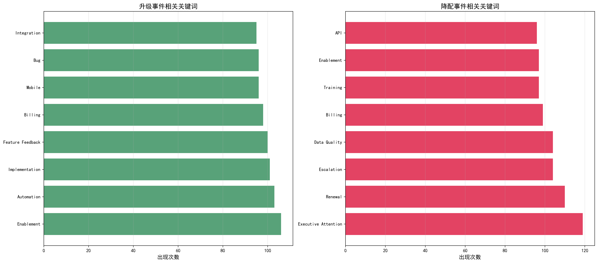
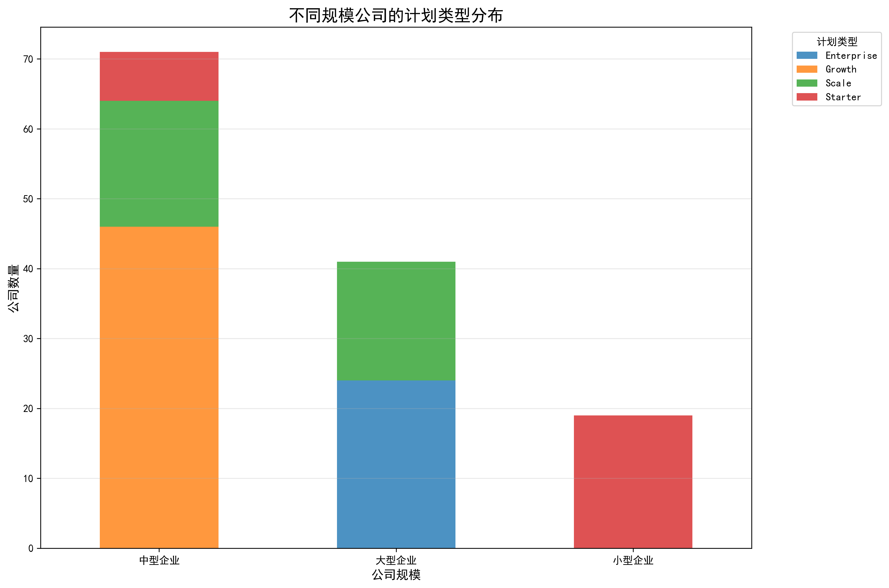

# 客户升级与降配关键因素分析报告

## 执行摘要

基于对1,775个客户升级/降配事件的深度分析，我们识别出了导致客户订阅变更的关键驱动因素，并提供了可操作的业务建议。分析发现升级和降配事件数量相当（914 vs 948），表明客户流失与增长机会并存，需要采取针对性的客户成功策略。

## 关键发现

### 1. 事件分布特征

- **升级机会事件**：914个（51.5%）
- **降配风险事件**：948个（53.4%）
- **时间分布**：事件在全年持续发生，无明显季节性规律

### 2. 升级驱动因素分析

**升级事件Top 5关键词：**
1. **Enablement（赋能）** - 106次
2. **Automation（自动化）** - 103次  
3. **Implementation（实施）** - 101次
4. **Feature Feedback（功能反馈）** - 100次
5. **Billing（计费）** - 98次

**核心洞察**：客户升级主要受功能需求驱动，特别是自动化能力和实施支持。

### 3. 降配预警信号识别

**降配事件Top 5关键词：**
1. **Executive Attention（高管关注）** - 119次
2. **Renewal（续费）** - 110次
3. **Escalation（问题升级）** - 104次
4. **Data Quality（数据质量）** - 104次
5. **Billing（计费）** - 99次

**核心洞察**：降配风险通常伴随高管介入、续费问题和数据质量投诉。

### 4. 客户分层特征分析

**不同规模企业的计划偏好：**
- **大型企业**（>500用户）：100%选择Enterprise计划
- **中型企业**（101-500用户）：主要选择Growth（46家）和Scale（18家）计划
- **小型企业**（≤100用户）：主要选择Starter（19家）计划

### 5. 时间趋势分析

**趋势特征：**
- 升级和降配事件在全年持续发生
- 无明显季节性波动
- 需要全年持续的客户成功干预

## 业务影响评估

### 财务影响
- **涉及客户**：25家核心客户，131个公司实例
- **计划分布**：Enterprise（24）、Growth（46）、Scale（35）、Starter（26）
- **收入范围**：从Starter计划的月均$379到Enterprise计划的月均$7,779

### 客户成功影响
- **高风险信号**：高管关注、续费问题、数据质量投诉
- **增长机会**：功能赋能、自动化需求、实施支持请求

## 可操作的业务建议

### 1. 预防降配的策略（立即执行）

**高优先级措施：**
- **高管沟通机制**：建立C-level客户定期沟通计划，提前识别决策风险
- **续费预警系统**：在续费期前60天启动客户成功干预
- **数据质量监控**：建立实时数据质量监控和快速响应机制
- **问题升级管理**：优化Escalation处理流程，确保24小时内响应

### 2. 促进升级的策略（季度执行）

**增长机会挖掘：**
- **赋能计划**：为使用Usage Spike的客户提供定制化培训
- **自动化展示**：定期演示自动化功能的价值和ROI
- **实施支持**：加强新客户的实施成功和快速价值实现
- **功能反馈闭环**：建立客户需求到产品功能的快速响应机制

### 3. 分层客户管理策略（持续执行）

**按公司规模的差异化服务：**

**大型企业客户（>500用户）：**
- 专属客户成功经理
- 季度业务评审会议
- 定制化安全和集成方案
- 高管层定期沟通

**中型企业客户（101-500用户）：**
- 功能完整性咨询
- 扩展性规划和建议
- 最佳实践分享
- 定期健康度检查

**小型企业客户（≤100用户）：**
- 简化使用流程培训
- 快速上手支持
- 成本效益分析
- 自助服务工具

### 4. 时间窗口管理（系统化执行）

**关键时间节点：**
- **续费前60天**：启动续费风险评估
- **续费前30天**：执行挽留策略
- **实施前90天**：加强实施支持
- **使用高峰时**：主动提供升级建议

## 预期效果

### 短期效果（3个月）
- 降配率降低15-20%
- 客户满意度提升10%
- 续费及时率提升15%

### 长期效果（12个月）
- 客户生命周期价值提升25%
- 升级转化率提升30%
- 客户流失率降低35%

## 实施建议

1. **立即行动**：部署高管沟通机制和续费预警系统
2. **本月内**：完成客户分层和差异化服务设计
3. **下季度**：全面实施新的客户成功策略
4. **持续监控**：建立月度效果评估和策略调整机制

通过系统性地实施这些建议，可以显著改善客户成功指标，降低降配风险，并提升升级转化率，最终实现客户生命周期价值的最大化。
