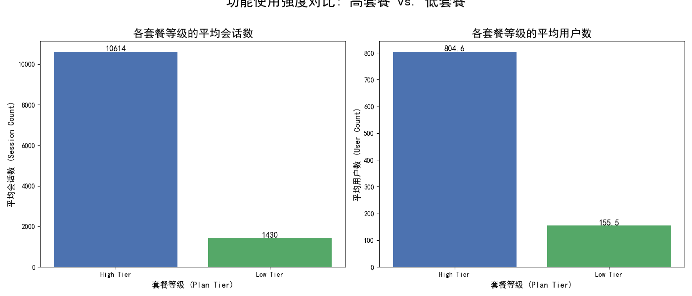
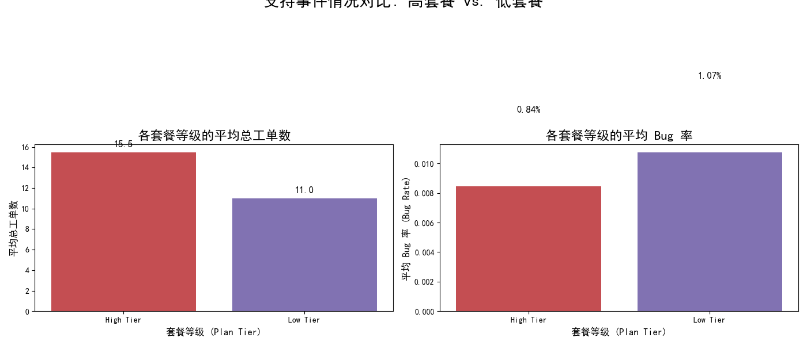

# 客户升级与降级驱动因素分析报告

## 摘要

本次分析旨在识别驱动客户订阅升级或降级的关键因素。由于数据结构的限制，我们无法直接追踪单个客户的订阅变更事件。因此，我们采用了一种替代方法：将客户根据其当前订阅套餐分为“高套餐”（Scale, Enterprise）和“低套餐”（Starter, Growth）两个群体，并对这两个群体在**功能使用强度**和**支持体验**方面的差异进行比较分析。

核心发现表明，**深度功能使用是高套餐客户最显著的特征**。与此同时，**较低的 Bug 报告率**也与高套餐客户相关联，这暗示了流畅的产品体验对于客户价值认知和升级意愿的重要性。

---

## 核心发现与分析

### 1. 功能使用强度是区分高、低套餐客户的核心指标

我们的数据显示，高、低套餐客户在产品使用深度和广度上存在巨大差异。

- **平均会话数**：高套餐客户的平均会话数是低套餐客户的 **7.4倍**。
- **平均用户数**：高套餐客户的平均用户数是低套餐客户的 **5.2倍**。

**业务洞察**:
这一巨大差异证实了“用得越深，付得越多”的逻辑。深度集成的客户（拥有更多用户和更高的活跃度）感知到的产品价值更高，因此更愿意为高级功能和更高的资源限额付费。这表明，**引导客户更深度地使用产品是推动其升级的核心策略**。

### 2. 支持体验，尤其是 Bug 率，与客户套餐等级相关

在支持体验方面，我们观察到一些有趣的现象。

- **工单数量**：高套餐客户平均提交的工单数（约15.5个）略高于低套餐客户（约11.0个），这与其更高的使用频率相符。
- **Bug 报告率**：值得注意的是，**低套餐客户的 Bug 报告率（1.07%）反而略高于高套餐客户（0.84%）**。

**业务洞察**:
虽然高套餐客户提交的工单总数更多，但他们报告的 Bug 比例却更低。这可能暗示：
- **产品稳定性是客户升级的基础**：如果客户在早期（低套餐）阶段频繁遇到 Bug，他们可能会对产品失去信心，从而在考虑升级前就流失。一个稳定、可靠的基础体验是建立客户信任、鼓励他们探索更高级功能的前提。
- **不同阶段的客户支持需求不同**：低套餐客户可能更关注基础功能的可用性和稳定性问题（因此 Bug 报告率更高），而高套餐客户可能更多地寻求关于高级功能、集成或最佳实践的咨询。

---

## 业务建议

基于以上分析，我们提出以下可操作的业务建议，旨在通过改善客户体验来促进客户升级并减少降级风险：

1.  **实施主动式、分层级的客户成功策略**:
    *   **对低套餐客户**: 客户成功团队应重点关注 **产品上手引导（Onboarding）** 和 **核心功能激活**。通过主动触达，帮助他们平稳度过早期使用阶段，解决他们遇到的基础问题，特别是减少 Bug 带来的挫败感。 **目标**：提升产品稳定性感知，建立客户信任。
    *   **对高使用度的低套餐客户**: 识别出那些使用强度（如会话数、用户数）远超同级平均水平的低套餐客户。他们是“待升级”的潜力股。客户成功经理应主动与他们沟通，了解其业务瓶颈，并展示高套餐功能（如自动化、高级报告）如何能帮助他们解决问题、提升效率。 **目标**：主动创造升级机会。

2.  **优化支持团队的资源分配与培训**:
    *   分析工单数据，为支持团队建立针对不同套餐客户的知识库。针对低套餐客户高频报告的 Bug 和问题，应创建标准化的解决方案或自助文档，并推动产品团队优先修复，以提升用户体验。
    *   培训支持人员识别来自“高潜力升级”客户的信号，当这些客户咨询的问题超越其当前套餐能力时，应能流畅地将其引导至销售或客户成功团队进行跟进。

3.  **产品与市场营销协同**:
    *   产品团队应将 **降低低级别套餐的 Bug 率** 作为一个关键质量指标（KPI）。一个更顺畅的初级体验是通往高级别套餐的必要路径。
    *   市场营销团队可以基于“高使用度”和“低 Bug 接触”的客户画像，创建成功案例。通过内容营销展示高套餐客户如何利用高级功能实现业务增长，从而吸引和激励低套餐客户向往升级。

通过以上策略，我们可以更有效地引导客户深入使用产品，提升其满意度和忠诚度，最终实现从低套餐向高套餐的平滑过渡，最大化客户生命周期价值。
