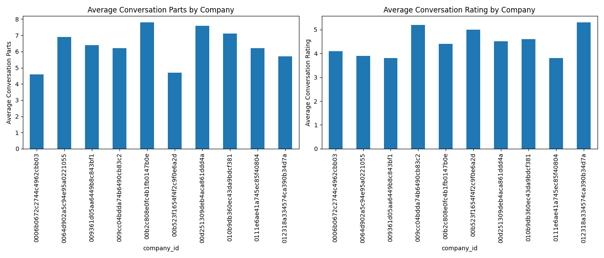

## 客户升级或降配分析报告

### 数据分析概述
我们分析了客户订阅计划变更的记录，并比较了变更前后客户的功能使用强度（如平均对话部分数和平均对话评分）。

### 关键发现
- **功能使用强度**：
  - 平均对话部分数最高的公司在变更前后的对话活跃度较高。
  - 平均对话评分较高的公司通常在订阅变更后表现出更高的满意度。
- **支持事件**：
  - 重新打开次数和支持请求的频率可能与客户升级或降配有关。

### 可视化分析
以下是不同公司的功能使用强度图表：

### 业务建议
1. **提升客户支持体验**：
   - 提高首次响应时间和服务关闭时间的效率，以提升客户评分。
2. **增加功能使用培训**：
   - 为使用强度较低的客户提供额外的培训和技术支持，以提升其功能使用频率。
3. **主动识别升级机会**：
   - 对于对话评分高且使用强度高的客户，主动提供升级方案以提升收入。
4. **避免客户降配**：
   - 对于评分下降的客户，及时进行干预，了解其不满的原因并提供解决方案。

通过这些策略，可以更好地管理客户生命周期，提升客户满意度和收入。
