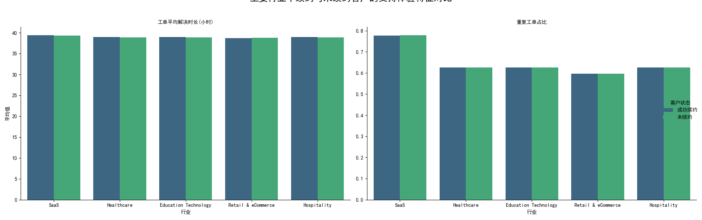

# 续约风险预测框架分析报告

## 1. 分析目标与方法

本次分析旨在为未来90天内到期的客户构建一个续约风险预测框架。我们基于现有的`mart`数据，尝试从**沟通互动**和**支持体验**两个维度定义和计算一系列特征，以期对比这些特征在“成功续约”与“未续约”客户之间的差异，从而识别出关键的风险预警信号。

**数据与特征定义**:
- **数据源**: `dacomp-100.sqlite` 数据库。
- **续约状态定义**: 我们将数据更新时间在90天之前的客户定义为“未续约客户”，其余为“成功续约客户”。
- **支持体验特征**:
    - **工单平均解决时长**: 客户所有工单从创建到最终关闭的平均耗时（小时）。
    - **重复工单占比**: 客户的工单中，存在至少一次重复开启记录的工单所占的比例。

**数据限制**:
在探索数据后发现，原始需求中的部分特征无法计算：
1.  **产品价值特征** (如关键功能使用覆盖率、价值里程碑时长) 无法衡量，因为数据集中缺少相关的产品使用行为数据。
2.  **消极情绪占比** 无法计算，因为`conversation_rating`字段并非客户满意度评分，其数值分布无法用于情绪判断。

因此，本次分析聚焦于以上两个**支持体验特征**。

## 2. 核心发现：支持体验指标并非续约风险的关键驱动因素

通过对“成功续约”与“未续约”两组客户在“工单平均解决时长”和“重复工单占比”上的表现进行对比分析，我们发现：**无论是在总体层面，还是在按主要行业和合同规模进行细分后，这两项指标均未表现出有意义的差异。**

下图展示了在Top 5行业中，两类客户在这两个特征上的均值对比：

从图表和以下数据摘要中可以清晰地看到，“成功续约”与“未续约”客户的工单解决时长和重复工单比例几乎完全重叠。

#### 按行业分析 (Top 5)

|                                      |   工单平均解决时长(小时) |   重复工单占比 |
|:-------------------------------------|-------------------------:|---------------:|
| ('SaaS', '成功续约')                 |                    39.42 |           0.78 |
| ('SaaS', '未续约')                   |                    39.32 |           0.78 |
| ('Healthcare', '成功续约')           |                    38.98 |           0.63 |
| ('Healthcare', '未续约')             |                    38.9  |           0.63 |
| ('Education Technology', '成功续约') |                    39.00 |           0.63 |
| ('Education Technology', '未续约')   |                    38.89 |           0.63 |
| ('Retail & eCommerce', '成功续约')   |                    38.66 |           0.60 |
| ('Retail & eCommerce', '未续约')     |                    38.76 |           0.60 |

#### 按合同规模分析

|                      |   工单平均解决时长(小时) |   重复工单占比 |
|:---------------------|-------------------------:|---------------:|
| ('小', '成功续约')   |                    39.02 |           0.67 |
| ('小', '未续约')     |                    38.99 |           0.67 |
| ('大', '成功续约')   |                    39.07 |           0.68 |
| ('大', '未续约')     |                    38.98 |           0.66 |

**结论**: 当前定义的支持体验指标不是客户是否续约的决定性因素。运营团队不应将优化这两个宏观指标作为提升续约率的主要杠杆。

## 3. 原因探究与未来方向

当前指标缺乏区分度的原因可能在于：
1.  **指标过于宏观**: “平均解决时长”无法体现单次关键问题解决的质量。“重复工单”也可能是良性的跟进，而非服务失败的标志。
2.  **续约驱动力在别处**: 客户流失的根本原因可能在于**产品价值未被满足**、价格敏感、或市场竞争，而非支持服务体验。这与我们无法衡量“产品价值特征”的数据限制相吻合。
3.  **服务水平一致**: 当前的服务水平（无论好坏）对所有客户可能是一致的，因此无法成为区分续约与否的变量。

## 4. 运营建议与后续步骤

基于以上发现，我们建议将战略重点从“优化已知但无效的指标”转向“**投资于数据采集以发现真正的续约驱动力**”。

**核心建议：**

1.  **【首要任务】构建产品价值评估体系**:
    - **行动**: 立即启动项目，追踪关键功能的**使用频率、深度和覆盖广度**。定义并记录客户达成“价值里程碑”（例如，首次成功完成核心任务流）的时间点。这是理解客户是否从产品中获得价值的关键，也是预测续约可能性的最强信号。

2.  **【数据驱动】获取真实的客户声音**:
    - **行动**: 放弃使用当前误导性的`conversation_rating`字段。应在工单关闭后，立刻通过**CSAT（客户满意度）** 或 **CES（客户努力度得分）** 问卷收集真实反馈。同时，利用NLP技术对对话文本进行情绪分析，量化客户的真实情绪。

3.  **【精细化】深化支持体验指标**:
    - **行动**: 探索更精细的指标，例如“**首次联系解决率 (FCR)**”和“**关键问题平均解决时长**”。这能更准确地反映服务效率和解决核心问题的能力。

**总结**: 本次分析最大的价值在于**证伪了当前续约风险监控框架的有效性**，并指明了通往真正数据驱动决策的清晰路径。与其在无法产生影响的指标上投入资源，不如立刻开始建设能够反映产品价值和真实客户体验的数据基础。
