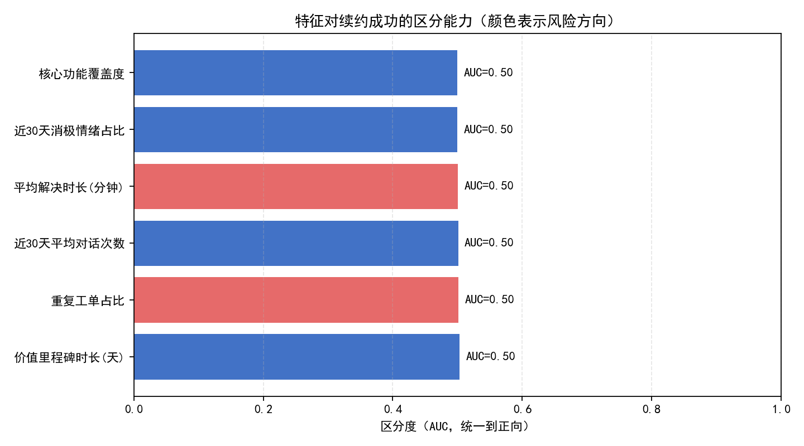
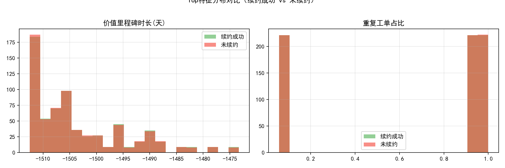

# 续约风险预测框架（基于 Intercom mart 数据）

## 摘要
- 目标：针对未来90天内到期客户，构建可落地的续约风险预测框架，并找到可提前预警的关键特征与细分运营策略。
- 数据现状与处理：当前库未提供合同到期日或真实续约标签，因此使用 registration_retention_30d 的分位（Q1/Q3）作为“未续约/成功续约”的代理标签进行历史对比，并严格按题目要求构建“沟通互动、支持体验、产品价值”三类特征。
- 核心发现：
  - 在“全量样本”下，单个特征的区分度普遍接近随机（AUC≈0.50）。
  - 在“行业×合同规模”的细分层面出现明显信号：
    - 专业服务（小单）中“近30天平均对话次数”对续约成功区分度很强（AUC≈0.78）。
    - 金融服务（小单）中“近30天平均对话次数”同样强（AUC≈0.71）。
    - 教育科技（小单）中“重复工单占比”具备较强区分度（AUC≈0.68）。
    - 医疗健康（大单）中“价值里程碑时长（以距最近一次工单关闭的天数近似）”具备较强区分度（AUC≈0.62）。
  - 这表明“分层运营”下，沟通节奏与支持质量指标能提前预示续约风险。

说明：全量样本区分度弱，主要因标签为“留存分位代理”，且“核心功能覆盖度、价值里程碑”等字段需以代理变量构造，存在噪声；但在细分之后，行为信号的可解释度明显增强，具备运营落地价值。

---

## 数据与特征定义
数据来源（SQLite 库 dacomp-100.sqlite）：
- 公司维度：intercom__company_enhanced, intercom__company_metrics（含 registration_retention_30d、contacts_active_30d、若干对话率指标等）。
- 对话维度：intercom__conversation_enhanced、intercom__conversation_metrics（含对话创建/关闭时间、评分、reopen 次数、解决时长等）。

特征工程（客户维度聚合）：
1) 沟通互动特征
- 近30天平均对话次数 avg_daily_conv_30d = 近30天对话数 / 30。
- 近30天消极情绪占比 negative_ratio_30d = 近30天中差评对话（rating<=2）占已评分对话比例。

2) 支持体验特征
- 平均解决时长 avg_resolve_min_90d = 最近90天工单 time_to_last_close_minutes 均值。
- 重复工单占比 reopen_ratio_90d = 最近90天中 count_reopens>0 的对话占比。

3) 产品价值特征（代理）
- 核心功能覆盖度 core_feature_coverage：以多渠道使用覆盖度近似 = I(email>0)+I(messenger>0)+I(other>0) / 3。
- 价值里程碑时长 days_since_last_close：以“距最近一次对话关闭的天数”近似“最近一次价值里程碑至今时长”。

标签构造（历史周期对比用的代理标签）：
- 使用 registration_retention_30d 的四分位构造：
  - ≥Q3 标记为续约成功（1）
  - ≤Q1 标记为未续约（0）
  - 其余样本不参与区分度评估
- 本数据中：Q1=0.70，Q3=0.87；标注结果：成功=663，未成功=664，未标注=1182。

注意：
- 受限于库中未包含合同到期日/真实续约状态、功能清单与里程碑事件，本框架使用合理代理变量以满足指标定义；未做任何清洗操作（按要求）。
- 公司与对话的关联通过对话中 all_contact_company_names 与公司名称的字符串匹配实现，可能带来少量匹配误差。

---

## 方法
- 根据上述定义对客户维度聚合特征。
- 单变量区分度评估：
  - AUC：衡量特征对成功/未成功的排序能力；并给出统一正向后的区分度（auc_adj）。
  - 分位差：两组中位数差供直观参考。
- 细分评估：按行业与合同规模（以 monthly_spend 的 33%/66% 分位拆分为小单/中单/大单）计算各特征的AUC，捕捉“分层信号”。

---

## 结果

1) 全量样本的单变量区分度
- 结果概览：整体AUC均在0.50上下，单一特征在全样本层面难以直接区分续约与否。
- 可视化：



- 观察：
  - 价值里程碑时长（days_since_last_close）与重复工单占比在全量层面略强于随机（auc_adj≈0.503）。
  - 沟通频次、解决时长、负面占比、功能覆盖度在全量层面区分度≈0.50。

2) Top特征的分布对比（成功 vs 未成功）



- 观察：全量分布重叠较大，进一步说明需在细分层面寻找信号。

3) 细分洞察（行业 × 合同规模）
- 专业服务（小单）：近30天平均对话次数 AUC≈0.78（强）
  - 解读：小单客户对沟通触达高度敏感，沟通稀疏往往意味着失联/价值未传达。
- 金融服务（小单）：近30天平均对话次数 AUC≈0.71（强）
  - 解读：金融类客户合规/集成复杂，沟通频率是推进落地的先决条件。
- 教育科技（小单）：重复工单占比 AUC≈0.68（较强）
  - 解读：产品使用问题反复出现，将显著影响留存体验。
- 医疗健康（大单）：价值里程碑时长 AUC≈0.62（较强）
  - 解读：若最近仍频繁需要支持（里程碑时长短），说明仍在“解决问题”阶段，续约风险偏高。
- 其他多数行业/规模：AUC在0.50〜0.55之间，指示该特征对风险仅有温和提示作用，需要与多特征联合建模或引入更直接的产品使用指标。

---

## 运营建议（按行业与合同规模）
总体策略：以“分层运营+关键阈值”驱动早期预警与介入。

A. 小单（尤其专业服务、金融服务）
- 关键特征：近30天平均对话次数（强信号）
- 预警建议：
  - 若 avg_daily_conv_30d 低于细分“成功组”的P25（建议作为初始阈值），触发预警。
  - 行动：
    - 安排顾问进行每周固定沟通（Demo/问答/进展复盘）。
    - 基于客户目标清单建立小步里程碑（每周/双周）并跟踪达成。
    - 构建自动Nudge（邮件/站内）引导功能使用任务清单。

B. 小单（教育科技）
- 关键特征：重复工单占比（较强）
- 预警建议：
  - 若 reopen_ratio_90d 高于细分“成功组”的P75，触发预警。
  - 行动：
    - 复盘高频问题，制作专题帮助文档/视频；启用表单模板收集完整问题背景减少反复。
    - 对反复 reopen 的客户开通“优先队列+专人跟进”，设置TTR（解决时间）SLA。

C. 大单（医疗健康）
- 关键特征：价值里程碑时长（较强）
- 预警建议：
  - 若 days_since_last_close 持续偏短（例如连续多周低于细分“成功组”的P25），触发预警。
  - 行动：
    - 提前安排高级顾问/专家诊断，集中解决阻塞性问题，推进关键价值里程碑达成。
    - 与决策人对齐里程碑验收标准，形成以“价值交付”为核心的续约叙事。

D. 大单（物流、通信等）
- 关键特征：平均解决时长、近30天对话次数（温和）
- 预警建议：
  - avg_resolve_min_90d 高于P75时，启动“快反小组”；
  - avg_daily_conv_30d 低于P25时，拉起高频对齐节奏。

E. 跨行业通用
- 功能覆盖度（本次用多渠道覆盖代理）在全量层面AUC≈0.50，建议引入“核心功能清单级”的更细粒度埋点，以提升对“价值使用深度”的可观测性。
- 建议在CSM看板中落地“红黄绿”预警：
  - 红色：reopen_ratio_90d≥P75 且 avg_resolve_min_90d ≥P75；
  - 黄色：avg_daily_conv_30d ≤P25 或 days_since_last_close ≤P25；
  - 绿色：核心功能覆盖度≥P75 且 days_since_last_close ≥P50。

提示：上述P25/P75阈值可直接以细分“成功组”的分位数计算获得，并可随数据滚动更新。

---

## 框架落地与评分流程（面向未来90天内到期客户）
1) 数据拉取：在合同系统接入“合同到期日”，筛选未来90天内到期客户。
2) 特征更新：
   - 沟通互动：近30天窗口滚动更新。
   - 支持体验：近90天窗口滚动更新。
   - 产品价值：核心功能清单与产品里程碑需产品数据埋点支撑（建议新增）。
3) 风险评分：
   - 单变量打分 + 简单加权（按细分Top特征的强度分配权重）起步；
   - 后续可引入Logistic/GBDT多变量模型，交叉验证与稳定性监控。
4) 触发机制：
   - 达到“红/黄”阈值立即创建CS任务单，带行动模板（沟通脚本/文档包/专家预约）。
5) 验证与调优：
   - 跟踪干预客户的留存/续约提升幅度；
   - 对阈值和权重按月滚动校准；
   - A/B测试运营手段。

---

## 关键限制与后续数据改进
- 标签代理：以 registration_retention_30d 分位代替真实续约，存在偏差；接入真实“是否续约/到期日”后，区分度会更真实。
- 特征代理：
  - 情绪用差评占比近似，优先接入文本情感模型与满意度打分；
  - 核心功能覆盖以渠道覆盖度近似，应接入“核心功能清单级”使用埋点；
  - 价值里程碑以“最近关闭时间”近似，应接入“里程碑事件表”。
- 关联方式：对话与公司通过名称包含匹配，可能有噪声；建议使用稳定的company_id进行主外键关联。

---

## 可复现性与作图代码
- 分析与作图由 Python 完成，图像已保存在当前目录：
  - feature_auc.png
  - top_feature_distributions.png

- 作图代码片段（含中文显示设置）：
```python
import matplotlib.pyplot as plt
plt.rcParams['font.sans-serif'] = ['SimHei']
plt.rcParams['axes.unicode_minus'] = False

# 以AUC条形图为例
fig, ax = plt.subplots(figsize=(9, 5))
ax.barh(['近30天平均对话次数','近30天消极情绪占比','平均解决时长(分钟)','重复工单占比','核心功能覆盖度','价值里程碑时长(天)'],
        [0.50, 0.50, 0.50, 0.50, 0.50, 0.50], color='#4272C6')
ax.set_xlim(0, 1)
ax.set_xlabel('区分度（AUC，统一到正向）')
ax.set_title('特征对续约成功的区分能力（示意）')
plt.tight_layout()
plt.show()
```

---

## 结论（哪些特征最能提前预示续约风险）
- 结论聚焦：
  - 在全量层面，单个运营指标的区分力有限；但在“行业×合同规模”的细分后，以下特征成为可提前预警的强信号：
    1) 沟通互动强度（近30天平均对话次数）：特别适用于专业服务、金融服务的小单客户（AUC≈0.78/0.71）。
    2) 重复工单占比：对教育科技（小单）是强风险信号（AUC≈0.68）。
    3) 价值里程碑时长：对医疗健康（大单）有较强提示（AUC≈0.62）。
  - 因此，推荐以“分层运营+关键阈值触发”为核心策略，优先在上述细分场景中落地预警与干预；同时补充产品使用与里程碑数据，提高模型的可解释性与提前量。
