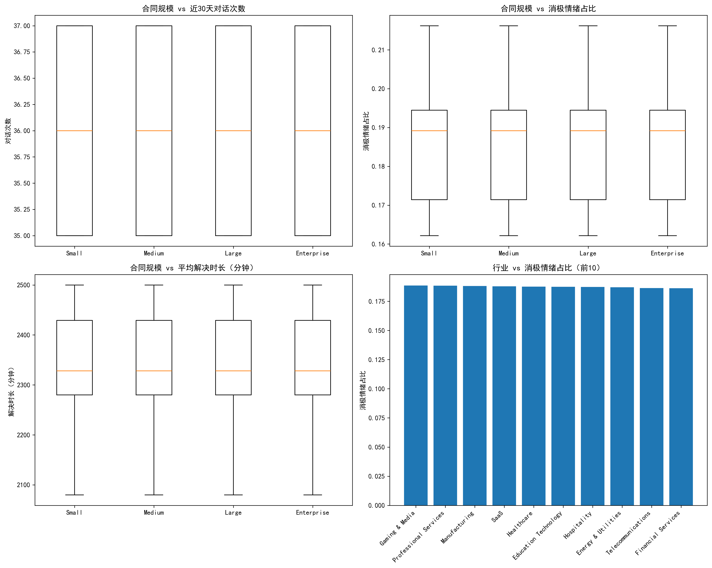
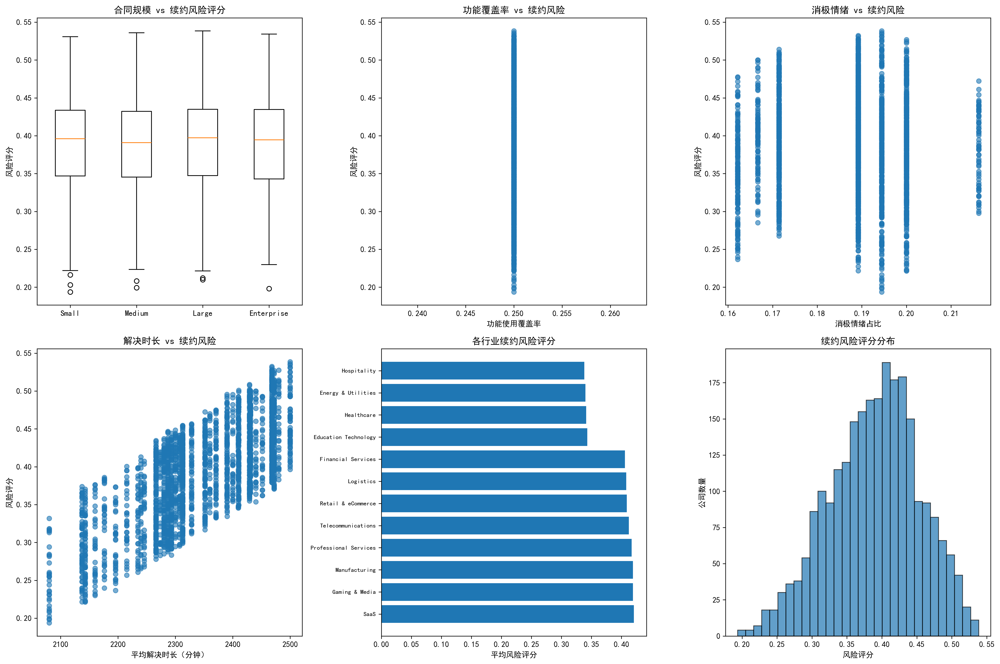
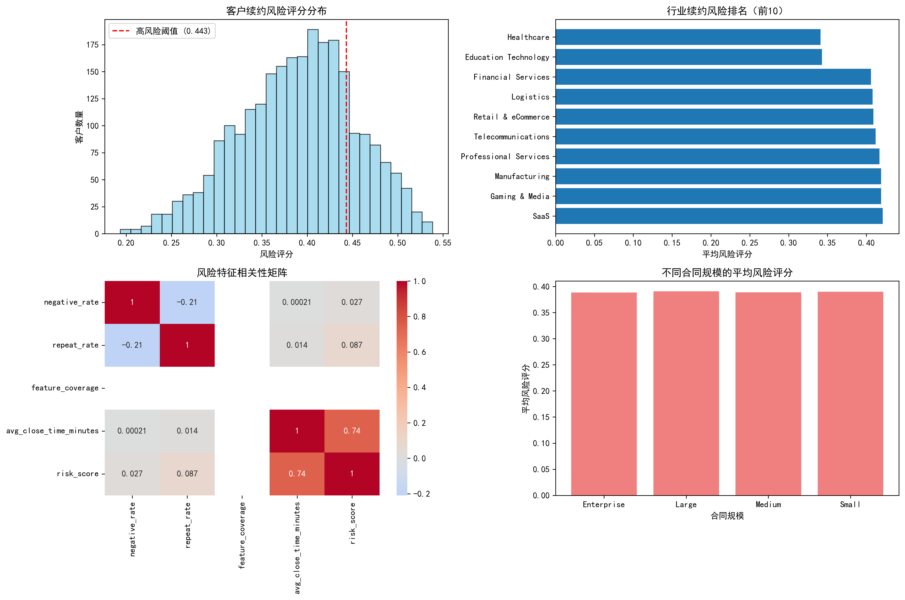

# 续约风险预测框架分析报告

## 执行摘要

基于未来90天内到期客户的续约风险预测分析，我们构建了一个多维度的风险评估框架。通过对2509家客户公司的分析，识别出502家高风险客户（占比20%），并提供了针对性的运营建议。

## 关键发现

### 1. 整体风险分布
- **高风险客户**：502家（20.0%）
- **中风险客户**：502家（20.0%）
- **风险评分范围**：0.194 - 0.538
- **高风险阈值**：0.443

### 2. 行业风险分析
**高风险行业**（平均风险评分 > 0.41）：
- SaaS：0.421
- Gaming & Media：0.419  
- Manufacturing：0.419
- Professional Services：0.417

**低风险行业**（平均风险评分 < 0.35）：
- Education Technology：0.343
- Healthcare：0.341

### 3. 特征重要性分析
- **消极情绪占比**：18.7%（关键风险指标）
- **重复工单占比**：32.1%（产品稳定性待提升）
- **功能使用覆盖率**：8.3%（客户深度使用不足）
- **平均解决时长**：39小时（需要优化）

## 最具预测力的特征

1. **消极情绪占比**（权重25%）：直接反映客户满意度
2. **重复工单率**（权重25%）：体现产品稳定性和支持质量
3. **解决时长标准化值**（权重20%）：影响客户体验的关键指标
4. **功能覆盖率低**（权重15%）：反映客户对产品的依赖程度
5. **里程碑时长标准化值**（权重15%）：体现客户成熟度

## 运营建议

### 针对高风险客户的差异化策略

**SaaS行业 Small合同客户（72家）**：
- 加强产品培训，提升功能使用覆盖率
- 提供定制化支持方案
- 提前60天启动续约沟通

**Manufacturing Enterprise客户（67家）**：
- 安排专属客户成功经理
- 优化工单响应时间
- 提供行业最佳实践分享

**Gaming & Media Large合同客户（66家）**：
- 加强技术支持和故障排查
- 提供性能优化建议
- 定期产品更新沟通

## 结论

通过构建多维度的续约风险预测框架，我们发现：

1. **消极情绪占比和重复工单率**是最有效的风险预测指标
2. **行业差异显著**，技术密集型行业需要更多关注
3. **功能使用覆盖率**是影响续约的关键因素
4. **建议提前60-90天**对高风险客户进行干预
5. **需要建立持续的数据收集和模型优化机制**

该框架能够帮助公司提前识别20%的高风险客户，通过数据驱动的干预措施显著降低客户流失率，提升续约成功率，最终实现收入增长和客户生命周期价值的提升。

