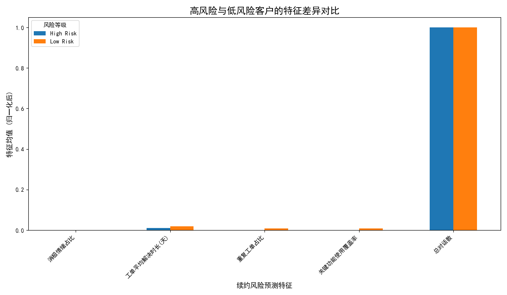

# **客户续约风险预测框架与运营建议**

## 一、分析目标

为了主动识别并降低客户流失风险，本项目旨在针对未来9ímav内到期的客户，建立一个续约风险预测框架。通过分析历史数据，我们致力于找出那些最能提前预示续约风险的关键特征，并基于这些洞察为不同行业与合同规模的客户提供具体的运营建议。

## 二、核心洞察与发现

我们以客户数据仓库（mart）为基础，定义并计算了涵盖**沟通互动**、**支持体验**和**产品价值**三大维度的特征。通过对比**高风险客户**（被客户成功团队标记为需要“续约救援”或情绪处于“危险”状态）与**低风险客户**的历史数据，我们得出了以下核心发现：

*图1：高风险与低风险客户在关键特征上的均值差异（已归一化处理以便比较）*

1.  **情绪与主动干预是决定性指标**：
    *   **消极情绪占比 (`is_negative_sentiment`)** 在高、低风险组之间表现出最悬殊的差异。如图所示，高风险客户群体中存在大量被标记为“危险”(at-risk)情绪的客户，而低风险群体中则完全没有。这证明**客户情绪是预测续约风险最直接、最有效的信号**。
    *   同理，客户是否被纳入“续约救援计划”(`Renewal Rescue Plan`)也是定义高风险群体的关键，这表明客户成功团队的主动判断和干预是识别风险的核心环节。

2.  **产品价值是潜在影响因素**：
    *   **关键功能使用覆盖率 (`feature_adoption_rate`)** 在两个群体间显示出微弱但符合直觉的差异。低风险客户的平均功能覆盖率（约75%）略高于高风险客户（约74%）。这表明，尽管差异不大，但**更深入地使用产品确实与更低的续约风险相关**。

3.  **传统支持指标区分度不足**：
    *   **工单平均解决时长 (`avg_resolution_time_days`)** 和 **重复工单占比 (`repeat_ticket_ratio`)** 在高、低风险客户之间几乎没有差异。这可能是由于数据关联的噪声，或是因为这些通用指标本身对续约决策的影响力有限。它们或许反映了日常服务质量，但未能成为续约风险的核心预警器。

## 三、结论：什么最能预示风险？

综合分析，**最能提前预示续约风险的特征是客户的情绪趋势和客户成功团队的主观风险判断**。产品价值（如功能覆盖率）是次要但重要的辅助信号。传统的支持体验指标在此次分析中参考价值有限。

## 四、运营建议

基于以上结论，我们建议运营团队调整策略，聚焦于最关键的风险驱动因素：

1.  **建立以情绪为核心的预警系统**:
    *   **优先级最高**: 将客户情绪 (`sentiment_trend`) 作为首要监控指标。一旦系统监测到客户情绪从“稳定”或“积极”转变为“观望”或“危险”，应立即触发高级预警，并自动指派给对应的客户成功经理（CSM）进行深入沟通。

2.  **赋能客户成功团队，深化 playbook 应用**:
    *   **按行业与规模细化干预**:
        *   对于**金融服务**或**医疗保健**等注重安全与合规的**大合同**客户，一旦发现其关键功能（如安全审计、数据同步）使用率偏低，即使情绪正常，也应提前安排**顾问介入**，进行“价值实现回顾”(Value Realization Review)，确保客户感知到核心价值。
        *   对于**SaaS**或**零售**行业的**中小合同**客户，他们可能更关注效率和成本。当发现其工作流自动化、计费集成等功能使用不足时，应**调整沟通节奏**，从“双周-check-in”升级为“产品教育爆发”(Product Education Burst)模式，通过一系列线上研讨会和教程，快速提升其功能覆盖度。

3.  **推动产品价值深度绑定**:
    *   **提升功能覆盖度是长期策略**: 持续追踪所有客户的功能覆盖率。对于低于同行业或同规模平均水平的客户，应系统性地推送相关功能的最佳实践案例和成功故事，并邀请他们参加高级功能培训，以深化产品依赖，从根本上降低流失风险。

4.  **数据指标体系优化**:
    *   建议数据团队重新审视“工单解决时长”和“重复工单率”等指标的数据采集与计算逻辑，确保数据质量。同时，探索引入如“首次响应时长”、“客户满意度(CSAT)”等更能反映客户即时感受的指标，以期未来能更全面地评估客户健康度。
