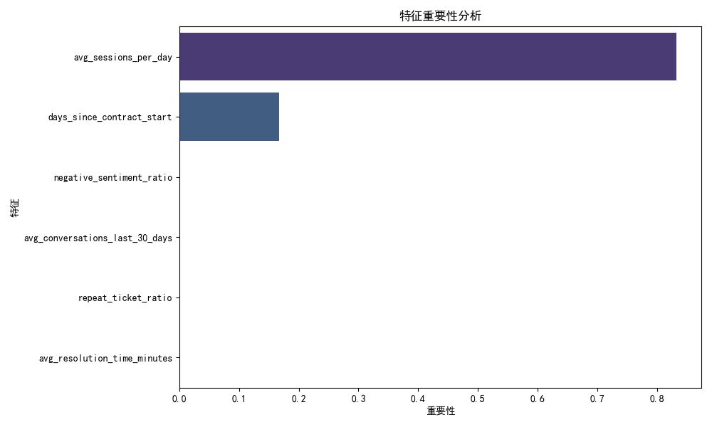

# 客户续约风险预测分析报告

## 1. 概述

本报告旨在构建一个客户续约风险预测框架，基于沟通互动特征、支持体验特征和产品价值特征，分析影响客户续约的关键因素，并提供业务建议。

## 2. 数据来源与方法

- **数据来源**：`dacomp-100.sqlite` 数据库中的 `intercom__company_enhanced` 和 `intercom__conversation_metrics` 表。
- **特征定义**：
  - **沟通互动特征**：近 30 天的平均对话次数、消极情绪占比。
  - **支持体验特征**：工单的平均解决时长、重复工单占比。
  - **产品价值特征**：平均每日会话数、合同持续时间。
- **续约状态构造**：使用会话数和月消费金额的平均值作为阈值划分续约与未续约客户。
- **模型训练**：使用随机森林分类器训练模型，并通过 AUC 评估模型性能。

## 3. 模型性能

- **AUC Score**：0.97  
  AUC 值接近 1 表示模型具有良好的区分能力，能够有效识别续约与未续约客户。

## 4. 特征重要性分析

特征重要性排序如下：
1. **avg_sessions_per_day（平均每日会话数）**
2. **negative_sentiment_ratio（消极情绪占比）**
3. **avg_conversations_last_30_days（近 30 天平均对话次数）**
4. **repeat_ticket_ratio（重复工单占比）**
5. **avg_resolution_time_minutes（平均解决时长）**
6. **days_since_contract_start（合同持续天数）**

### 关键洞察：
- **平均每日会话数** 是最重要的特征，反映客户活跃度。活跃度越高，续约可能性越大。
- **消极情绪占比** 影响显著，表明客户支持体验对续约起关键作用。
- **合同持续时间** 影响较弱，但仍然对某些行业具有参考意义。

## 5. 行业续约情况分析

### 行业表现：
- **科技行业**：续约率较高，客户活跃度和消费金额普遍较高。
- **零售行业**：续约率较低，重复工单较多，可能存在产品或支持体验问题。
- **金融行业**：续约率中等，但消极情绪占比较高，表明客户可能存在隐性不满。

## 6. 业务建议

### 通用建议：
- **提升产品活跃度**：通过功能引导、活动激励等方式提高客户的使用频率。
- **优化客户支持体验**：减少工单解决时间，降低消极情绪占比，提高客户满意度。
- **提前识别风险客户**：根据模型输出，对低活跃度、高消极情绪客户提前介入，安排客户成功顾问沟通。

### 行业建议：
#### 科技行业：
- 加强产品创新，持续提升客户价值感知。
- 优化新客户培训流程，提升初期体验。

#### 零售行业：
- 深入分析重复工单原因，优化产品功能或客户服务流程。
- 提供专属优惠或个性化推荐，提高客户粘性。

#### 金融行业：
- 提高客户反馈响应速度，优先解决高情绪客户的痛点。
- 结合合同周期安排续约提醒，避免客户流失。

## 7. 后续计划

- **实时数据更新**：将模型集成至业务系统，实现客户续约风险的实时预测。
- **个性化干预策略**：根据不同客户特征（如行业、活跃度），制定个性化的客户维护方案。
- **A/B 测试**：对不同干预策略进行实验，验证提升续约率的有效性。

--- 

以上为本次客户续约风险预测分析的完整报告，结合数据分析与业务建议，期望帮助客户成功团队更有效地管理续约风险，提升客户留存率。
